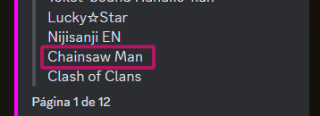

# /sofi series eliminar

Elimina una serie de la lista de series coleccionadas.

### Parámetros



**`Tipo:`** Texto

**`Obligatorio?`** :white\_check\_mark:

**`Descripción:`** Nombre de la serie que se quiere eliminar de la lista.


El nombre de la serie se tiene que escribir **exactamente igual** al que aparece en [**/sofi series lista**](sofi-series-lista.md), si no no funcionará:




Este campo se autocompleta con las series conocidas por Modereta pero se puede añadir cualquier serie aunque no aparezca en la lista, solo se tiene que escribir el nombre completo como aparece en la imagen de arriba.



